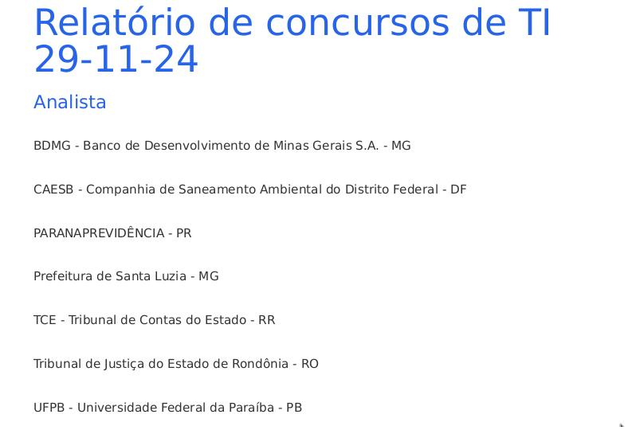
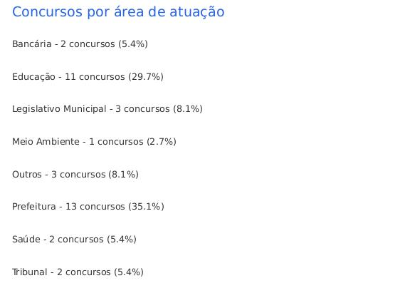

# Relatório de concursos de TI


## 📖 Descrição






Esse projeto diz respeito a uma aplicação capaz de extrair informações de concursos na área de tecnologia da informação (TI) ocorrendo nesse momento do site [PCI Concursos](https://www.pciconcursos.com.br/). Além dos links e nomes dos concursos, o relatório disponibiliza estatísticas que ajudam a ter uma visão abrangente sobre o cenário de concursos da área.

## 🛠️ Funcionalidades

- Listagem de concursos separados por cargo (Analista, Técnico e Professor);
- Estatísticas de concursos por cargo;
- Estatísticas de concursos por estado;
- Estatísticas de concursos por região;
- Estatísticas de concursos por área de atuação.


## 📡 Tecnologias utilizadas

<div align="center"> 

  
</div>
<br/><br/>

## ⏳ Inicialização

Esse projeto foi desenvolvido utilizando a linguagem Python com o uso de bibliotecas para Web Scraping ([beautifulsoup4](https://pypi.org/project/beautifulsoup4/)) e para conversão de arquivos Markdown em PDF ([m2pdf](https://pypi.org/project/md2pdf/)) e em HTML ([Markdown](https://pypi.org/project/Markdown/)).

Em primeiro lugar, você precisa instalar as dependências para executar a aplicação, o que pode ser feito pelo comando abaixo:
<br>


```shell
pip install -r requirements.txt
```

<br>

Depois de instaladas as dependências, você poderá executar um dos comandos abaixo:

***Relatório padrão (MD)***
```shell
python3 main.py
```

***Relatório HTML***
```shell
python3 main.py --html
```

***Relatório PDF***
```shell
python3 main.py --pdf
```

***Relatório em todos os formatos possíveis (MD, HTML e PDF)***
```shell
python3 main.py --html --pdf
```

Independentemente do comando escolhido, sempre haverá o relatório base no formato MD. O relatório conterá as informações sobre concursos de TI ocorrendo agora e estatísticas relevantes.


## 🤵🤵‍♀️ Colaboradores

No momento, o único colaborador do projeto é o Eduardo Vitor.

<br/>

## 🔎 Status do Projeto


<br/>

## 📑 Referências

[beautifulsoup4](https://pypi.org/project/beautifulsoup4/)

[m2pdf](https://pypi.org/project/md2pdf/)

[Markdown](https://pypi.org/project/Markdown/)


